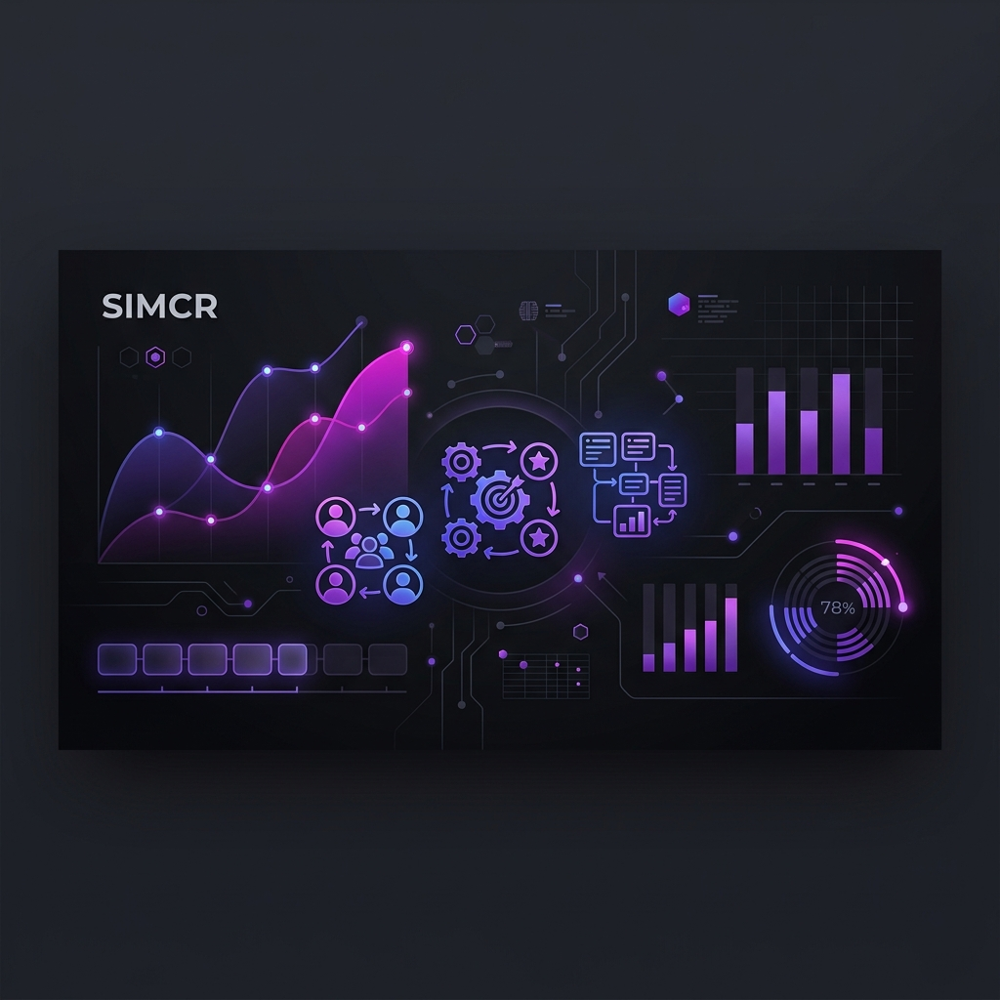

# SIMCR - Sistem Informasi Manajemen Client & Repository



<p align="center">
    
    
    
    
</p>

## 🚀 About SIMCR
**SIMCR** adalah platform manajemen proyek dan kolaborasi yang dirancang untuk menjembatani kebutuhan antara **Client** dan **Developer**. Dengan antarmuka modern berbasis **KaiAdmin**, sistem ini memungkinkan pengelolaan alur kerja yang efisien, mulai dari inisiasi proyek hingga pemantauan status real-time.

## ✨ Fitur Unggulan
*   **Multi-Role Access Control**: 
    *   **Admin/Leader**: Kendali penuh atas sistem dan pemantauan global.
    *   **Project Manager (PM)**: Manajemen detail proyek dan alokasi resource.
    *   **Developer**: Akses portofolio, spesialisasi, dan tugas proyek.
    *   **Client**: Pemantauan progress proyek dan detail perusahaan.
*   **Dynamic Profile**: Form profil yang beradaptasi secara otomatis berdasarkan role pengguna (Data Perusahaan untuk Client, Portofolio & Spesialisasi untuk Developer).
*   **Project Management**: Sistem penugasan developer dengan role spesifik dalam setiap proyek.
*   **Master Data Management**: Manajemen spesialisasi developer dan status proyek yang dapat dikustomisasi.
*   **Global Search & Security**: Pencarian data cepat di seluruh modul dan keamanan data tingkat lanjut.

## 🛠️ Tech Stack
*   **Core**: Laravel 11
*   **Database**: MySQL
*   **Frontend**: Bootstrap 5, KaiAdmin Dashboard Template
*   **Interactive Components**: jQuery, BSSelectDrop, SweetAlert, Chart.js

## 📦 Instalasi

1. **Clone Repository**
   ```bash
   git clone https://github.com/lufii-06/simcr.git
   cd simcr
   ```

2. **Install Dependencies**
   ```bash
   composer install
   npm install && npm run dev
   ```

3. **Environment Setup**
   ```bash
   cp .env.example .env
   php artisan key:generate
   ```
   *Sesuaikan konfigurasi database di file `.env`.*

4. **Database Migration & Seeding**
   ```bash
   php artisan migrate:fresh --seed
   ```

5. **Run Application**
   ```bash
   php artisan serve
   ```

## 📸 Screenshots
*(Tambahkan screenshot dashboard Anda di sini)*
> [!TIP]
> Gunakan `php artisan migrate:fresh --seed` untuk mendapatkan data awal (Specializations, Roles, Admin User) secara otomatis.

## 📄 License
Project ini dilisensikan di bawah [MIT license](https://opensource.org/licenses/MIT).

---
<p align="center">Made with ❤️ for Skripsi @ KULIAH TRANSFER</p>
